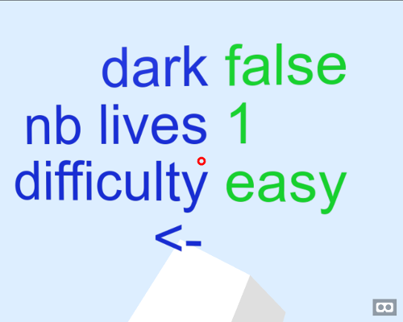

# MenuVR
A user frienfy menu to use in a-frame scene.

Example :
```javascript
var expl_menu = { 
    'play' :    function(){alert('play')},
    'options' : { 
        'dark':true,                                                                // values are boolean and default is true
        'nb lives':[1,2,3],
        'difficulty': ['easy','normal','hard']
    },
    'about':    'A text\nwith many lines\nand some informations',
    'exit':     function(){alert('quit')}
};
window.addEventListener('load',function(){
    var menu = new MenuVR(expl_menu);
//    var menu = new MenuVR(expl_menu,{line_height:0.2,fonts:'mono'});              // an other example
});
```

Screenshot :



**TODO :**
  - MenuVR.value(id)
  - MenuVR.onchange()
  - image value
  - int value
  - customise text color
  - ...

[ Donate :coffee: :beer: :tropical_drink: for my work and to improve it :wink: ](https://www.paypal.com/cgi-bin/webscr?cmd=_s-xclick&hosted_button_id=ZKUXBB8QFHHSQ)
